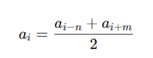

**《编程基础实践》任务书**

**一、编程基础实践目的**

通过本次实践，实现“海水养殖水质数据分析系统”，使学生掌握：

（1）C语言文件操作、动态内存管理、结构体编程等核心技能。

（2）时间序列数据处理与统计分析的基本方法。

（3）理解数据分析在智慧水产养殖中的实际应用价值。

（4）模块化程序设计与工程组织能力。

**二、项目背景**

**2.1 数据来源**

本数据集来自海南省陵水县新村镇海水养殖基地的物联网监测系统。该基地养殖环境如下：

- 监测周期：连续时间序列采集
- 采集频率：每5分钟一次
- 数据总量：23,203组

**2.2 数据内容**

每条记录包含6个环境参数：

| 参数  | 英文标识 | 单位  |
| --- | --- | --- |
| 水温  | Temp | ℃   |
| 盐度  | Salinity | PSU |
| pH值 | pH  | —   |
| 溶解氧 | DO  | mg/l |
| 降水量 | precipitation | m   |
| 气温  | Air_temp | ℃   |

**2.3 实际应用场景**

在海水养殖中，水质是影响鱼类产量的重要因素。水质剧烈变化会破坏藻类和细菌相平衡，导致鱼类应激、疾病甚至大规模死亡。准确的水质预测可以帮助养殖户提前采取措施调整水质，保障适宜的养殖环境，减少药物使用，实现绿色精准养殖。

本课程设计的目标是：开发一个C语言程序，对养殖基地的监测数据进行分析，揭示各参数的变化规律、相互关系，为水质预测提供数据支持。

**三、功能需求**

**模块一：数据基础操作**

**1.1 数据结构设计**

在养殖基地，传感器每5分钟采集一次数据，每天产生288条记录。程序需要高效存储和处理这些时间序列数据，为后续分析奠定基础。

要求：

（1）定义水质记录结构体。

（2）定义数据集结构体（或数组）

（3）存储数据集数据，应使用动态数组（结构体）还是静态数组？查找资料，说明原因。

**1.2 文件读取**

CSV数据集是从传感器中获取的数据，按下述要求读取CSV文件。

要求：

（1）自动跳过第一行（表头）

（2）使用动态内存分配，支持任意大小文件。例如：先分配初始容量（如1000），满则扩容（如每次翻倍）。

（3）应进行错误处理，例如文件不存在、格式错误、内存不足等。任何一步失败都应释放已分配内存并返回NULL。

（4）注意“空值”数据（详见2.2）的合理处理。

（5）读入总记录数和有效记录数写入数据概览文件。

**1.3 数据存储**

将数据预处理（模块二）后的数据写入文件，存储清洗后的数据，用于后续的数据分析（模块三）。

要求：

（1）能根据后续需求选择合适的存储格式（CVS文本 or 二进制文件）。

（2）应能顺序读取数据和随机读取数据。

（3）理解CVS文本格式与二进制格式的差异

（4）进行性能对比，对比不同存储方式的时间效率和空间效率

| 存储格式 | 文件大小（字节） | 写入时间（秒） | 读取时间（秒） | 人类可读 |
| --- | --- | --- | --- | --- |
| CSV文本 |     |     |     | 是   |
| 二进制 |     |     |     | 否   |

（5）分析讨论：什么场景适合用CSV格式？什么场景适合用二进制格式？通过查找资料，思考为什么实际存储大小与理论原始数据大小有区别。

**1.4 数据查询**

用户需要浏览数据内容，查看特定条件下的数据。

要求：

（1）分页浏览：数据量较大，需要实现分页显示，每页显示15条记录。支持翻页操作（下一页/上一页/跳转到指定页）。

（2）按条件筛选：支持按参数范围筛选显示。例如：显示水温在25-30℃之间的记录。参数和范围区间由用户输入。

（3）按参数排序：支持按任意参数升序或降序显示。例如：按溶解氧从高到低排序。

**1.5 数据修改**

发现错误数据时，需要对数据进行修改。

要求：

（1）单条修改：支持修改指定记录的任意参数值。

（2）修改前验证：新值必须在合理范围内（参见2.1）。

（3）修改后提示：询问用户是否保存到文件。

（4）在修改数据前，自动备份原始数据。

**1.6 数据删除**

删除明显错误或无效的记录。

**要求**：

（1）单条删除：删除指定记录号的单条数据。

（2）批量删除：支持按条件批量删除。

（3）删除确认：所有删除操作必须有确认提示，防止误操作。

（4）在删除数据前，自动备份原始数据。

**1.7 数据备份与恢复**

在智慧海洋养殖中，数据就是资产。一旦因为断电、程序崩溃或误操作丢失，都会造成不可挽回的损失。需要实现对数据备份与恢复模块，保护数据安全。

要求：

（1）数据备份功能

功能描述：程序将当前内存中的数据保存为一个带有时间戳或版本号的备份文件。

实现逻辑：程序应能自动或手动触发备份。备份文件名应包含日期或序号，例如backup_20260510.csv，防止覆盖旧备份。

备份完成后，在控制台提示“备份成功，文件已保存至...”。

（2）数据恢复功能

功能描述：允许用户从备份文件中读取数据，恢复到系统内存中。

实现逻辑：程序列出所有可用的备份文件供用户选择。用户选择后，程序读取该文件内容，验证数据格式是否合法（如检查行数、列数）。

验证通过后，将数据加载到系统，并提示“恢复成功”。

**模块二：数据预处理**

**2.1检测异常值**

传感器可能因设备老化、供电故障、人工增氧、投饵、换网等原因产生异常数据。数据验证可以识别这些问题，避免错误数据影响分析结论。

数值合理范围如下表，超出合理范围的数据为异常值数据。

| 参数  | 最小值 | 最大值 |
| --- | --- | --- |
| 水温  | \-5 | 40  |
| 盐度  | 0   | 45  |
| pH  | 6.5 | 9.0 |
| DO  | 0   | 15  |
| 降水量 | 0   | 500 |
| 气温  | \-10 | 50  |

要求：

（1）根据上表数值合理范围识别异常数据，输出数据概览（总记录数、异常数据记录数，有效数据记录数，异常数据时间跨度，异常数据错误参数个数）

（2）处理异常数据

1）若一条记录出现异常的数据大于等于3个，则整条记录删除

2）若一个记录出现异常的数据小于3个，删除异常数据，并采用2.2的均值逼近法进行填充。

（3）分析讨论：通过查找资料，给出异常值处理的方法，分析（2）异常值处理方法是否合理。

（4）修复异常值记录数和删除异常值记录数写入数据概览文件。

（5）处理后数据能存储到文件。

**2.2 缺失值处理——均值逼近法**

由于供电故障、传感器老化、人工增氧、投饵、换网以及电压不稳定等原因，接收到的数据可能存在丢失、缺陷和错误。均值逼近法可以有效填补这些缺失值，保证时间序列的连续性。

缺失值常见形式：

| 类型  | 表示形式 | 示例  |
| --- | --- | --- |
| 空值  | 连续两个逗号之间无内容 | 25.6,34.0,,8.15,0.001,27.8 |
| 特殊数值 | 使用特定数值标记 | \-999, -9999 |
| NaN | Not a Number | NaN, nan |

均值逼近法公式如下：
a(i) = (a(i-n)+a(i+m))/2

其中 ai 为第 i 个缺失数据，ai−n为前面第 n个有效数据，ai+m为后面第 m个有效数据。默认情况下n和m取值为10。
其中a(i)为第i个缺失数据，ai−n为前面第n个有效数据，ai+m为后面第m个有效数据。默认情况下n和 m取值为10。

要求

（1）能处理边界情况和异常情况：若某方向无有效值，则使用另一方向的有效值；若两方向均无有效值，使用该数据的全集均值

（2）统计处理的缺失值个数，并写入数据概览文件。

（3）处理后数据能存储到文件。

**2.2 数据滤波——移动平均法**

传感器数据通过4G无线模块远距离传输，容易受到近地噪声、收发器噪声等干扰。滤波操作可以滤除这些短期干扰，看清长期的变化趋势，提高数据质量。本次编程实践采用移动平均法进行数据滤波。

移动平均法公式：

其中N为窗口，N = 2k+1。

要求：

（1）分别用窗口3、5、7、9、11对水温、溶解氧、PH值、盐度数据进行滤波

（2）能处理边界问题。当计算数组开头或结尾的数据时，向前或向后取值会数组越界。应如何处理。

（3）处理后数据能存储到文件。

（4）分析讨论：能计算分析滤波前后的标准差变化（噪声减少程度）。通过查找资料和数据分析，分析窗口大小与噪声抑制程度的关系，确定最佳滤波窗口。

**模块三：统计分析**

**3.1 基本统计量**

基本统计量是基础的数据分析手段，通过计算均值、最值、标准差等统计量，可以快速了解每个参数的整体的情况。

**均值**：了解养殖海域的正常水质水平。

**最值**：识别历史极端事件（如暴雨导致的盐度骤降）。

**标准差**：量化参数稳定性，标准差大可预警环境剧烈波动。

要求：

（1）计算每个参数的均值、最大值、最小值、标准差。

（2）统计结果写入统计分析报告。

**3.2 分段统计**

水质监测数据采集了水温、盐度、pH、溶解氧、降水、气温等关键指标，但直接观察原始数据难以发现潜在风险。需要通过对时间序列数据进行科学的分段统计，挖掘数据背后的规律，为养殖户提供预警或管理建议。本模块通过分段统计，识别“凌晨缺氧”与“盐度突变”两大核心风险，并输出预警报告。

凌晨缺氧：溶解氧（DO）的最低值通常出现在凌晨（日出前），如果凌晨DO均值低于3-4mg/L，对虾容易缺氧死亡，应进行相应预警。

盐度突变：暴雨或换水会导致盐度骤降，对虾是变温动物，盐度突降会导致对虾产生渗透压应激反应，应进行相应预警。

要求：

（1）data.csv数据的时间序列是从2025年1月1日12:00开始，采集频率是5分钟。应能根据要求筛选出需要分段统计的数据段。

（2）凌晨缺氧预警：

筛选出每天03:00至05:00之间的DO数据，若DO均值 < 4.0 mg/L，即触发“亚缺氧预警”；若 < 3.0 mg/L，触发“严重缺氧预警”。处理建议： 亚缺氧时，建议开启底部增氧机；严重缺氧时，需立即投放颗粒氧并减少投喂。

（3）盐度突变预警：

变化率计算：计算每小时的盐度变化绝对值。公式为： ∣盐度t — 盐度t−12∣（其中 t 为当前时间点， t−12为1小时前的时间点）。若监测到盐度在1小时内下降超过2个单位（PSU），或在24小时内累计降幅超过5个单位（PSU），即判定为“盐度突变”，触发“盐度突变预警”。处理建议：立即关闭进水口，并泼洒高稳VC或葡萄糖以增强对虾抗应激能力

（4）将监测到的预警写入预警报告文件。包括预警时间、预警种类、处理建议等。

**3.3 相关性分析**

在海水养殖中，各水质参数之间存在相互关联。例如：水温升高，溶解氧下降，pH值变化，溶解氧随之变化，气温变化，水温随之变化。

皮尔逊相关系数是量化两个变量之间线性相关程度的重要指标。通过该方法能揭示各参数之间的关系，为水质预测提供了理论依据。

皮尔逊相关系数公式：

其中：_r_ 为相关系数，取值范围 \[−1,1\]，和分别为两个变量的均值。

皮尔逊相关系数含义：

| r 值范围 | 相关强度 | 含义  |
| --- | --- | --- |
| 0.8 ~ 1.0 | 极强相关 | 一个变量几乎决定另一个 |
| 0.6 ~ 0.8 | 强相关 | 关系密切 |
| 0.4 ~ 0.6 | 中等相关 | 存在明显关系 |
| 0.2 ~ 0.4 | 弱相关 | 有一定关系 |
| 0.0 ~ 0.2 | 极弱相关/无关 | 基本没有线性关系 |

正负号含义：

- r>0：正相关（一个增，另一个也增）
- r<0：负相关（一个增，另一个减）

要求：

（1）实现皮尔逊相关系数计算函数：计算两个参数的皮尔逊相关系数。

（2）输出完整的6×6相关系数矩阵。

（3）讨论分析：找出最强的正相关和最强的负相关；分析下述参数相关性（水温-DO、pH-DO、水温-气温、水温-盐度）。

（4）将6×6相关系数矩阵及相关结论写入统计分析报告文件。

**模块四：预测模型**

**4.1 单因素线性回归预测模型**

在智慧海洋养殖中，仅仅监测当前的水质参数是远远不够的，需要具备预见未来的能力。例如，如果能根据当前的气温变化趋势，提前预测出几小时后水体中的溶解氧（DO）含量，就可以提前开启或关闭增氧机，既能避免鱼类缺氧死亡，又能节约大量电能。

线性回归预测模型是一种基础的预测方法。它假设数据的变化遵循线性规律，通过历史数据拟合出一条直线，探究环境因子之间的内在联系，然后用这条直线对未来趋势进行预测。

线性回归预测基于最小二乘法原理，计算出最佳拟合直线 y = a\*x + b 的斜率 a 和截距 b。

**模型评估：**

方案1：使用决定系数R²进行模型评估。R²值越接近1，说明模型拟合效果越好。

计算公式如下：

方案2：

使用留出法对模型进行评估。

将数据集拆分成两部分：

- 训练集（前80%）：假设这是“过去”的数据，用来训练模型。
- 测试集（后20%）：假设这是“未来”的数据，用来验证模型。

训练集用于计算回归方程的 a和 b。利用算出的方程，把测试集的气温代入，计算出预测的溶解氧。将“预测的溶解氧”与训练集中真实的溶解氧进行对比，计算出评估指标：均方根误差（RMSE）。该评估指标用于衡量预测值与真实值之间的平均差距。

计算公式如下：

要求：

（1）使用线性回归方法探究气温（Air_temp）与溶解氧（DO）之间的关系，并建立一个预测模型，并实现预测函数。

（2）对预测模型使用决定系数进行模型评估；对预测模型使用留出法进行模型评估。

（3）多因子探索：尝试探究其他变量与溶解氧（DO）的关系，例如水温（Temp）与DO、pH与DO，盐度与DO，比较不同模型的R²值，判断哪个环境因子对溶解氧的影响更大。

（4）讨论分析：通过查找资料，分析单因素线性回归预测的预测准确度并分析相关原因。

4.2 选做：分析单因素线性回归预测模型的缺陷，查找资料，选用并实现效果更好的预测模型。

**模块五 系统集成**

**5.1 用户登录与权限管理**

在海水养殖生产环境中，水质数据是企业的核心资产，不应被所有人随意访问和修改。不同角色的人员需要有不同的操作权限。本模块要求实现用户登录与权限管理功能，实现“专人专权”，确保系统的安全运行。

| 角色  | 人员  | 职责  |
| --- | --- | --- |
| 管理员 | 养殖场管理人员、技术主管 | 拥有最高权限，允许访问所有功能 |
| 访客  | 参观人员、临时查看者 | 仅可查看数据概览和统计分析报告 |

要求：

（1）系统中预设至少两个账户：

管理员账户：用户名admin，密码123456，角色管理员。

访客账户：用户名guest，密码guest，角色访客。

（2）登录模块

程序启动时，首先进入登录界面。提示用户输入用户名和密码。验证逻辑：遍历用户列表，比对输入的用户名和密码是否与预设值匹配。

登录成功：记录当前登录用户的角色，进入主菜单。登录失败：提示“用户名或密码错误”，允许重新输入（限制最多尝试3次，超过则强制退出）。

（3）权限控制逻辑

在主菜单中，根据当前登录用户的角色，动态显示功能选项。管理员：可以看到所有功能选项。访客：只能看到“查看数据概览”和“统计分析”选项。

选做：

（1）增加用户注册功能。

（2）账户和密码进行密文存储。

（3）增加“技术人员”角色并规定相应权限

**5.2 菜单交互界面**

在实际的养殖管理系统中，技术人员需要一个易用的界面来日常监测水质、查看分析结果、运行预测模型。本模块任务是设计系统的前端交互部分，将前面模块集成到一个完整的系统中，设计统一的交互界面，让用户可以通过菜单选择执行不同的分析任务。

菜单样式示例：

\========================================

海水养殖水质分析系统 v1.0

\========================================

\[1\] 数据基础操作

\[2\] 数据预处理

\[3\] 统计分析

\[4\] 预测分析

\[5\] 查看数据概览

\[6\] 查看预警报告

\[7\] 查看分析报告

\[8\] 数据备份与恢复

\[9\] 清屏

\[0\] 退出系统

\========================================

请选择操作 (1-9):

要求：

（1）设计主菜单，实现菜单循环。

程序启动后显示菜单，等待用户输入选择，根据选择执行对应功能，执行完后返回菜单（除非选择退出），输入错误时提示并重新显示菜单。

（2）若某个功能需要设计子菜单，应进行子菜单设计，实现菜单循环。

**5.3 系统集成检查**

（1）**功能检查**

- 所有模块已成功整合到一个工程中
- 主菜单能正确显示
- 各菜单项能正确调用对应功能
- 子菜单能正常工作和返回
- 退出时有确认提示
- 未加载数据时访问功能有错误提示

**（2）代码检查**

- 使用多文件组织（.c和.h分离）
- 使用条件编译避免头文件重复包含
- 代码注释充分，命名规范